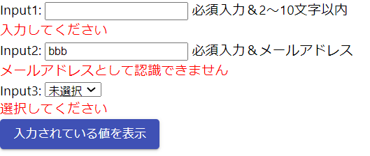
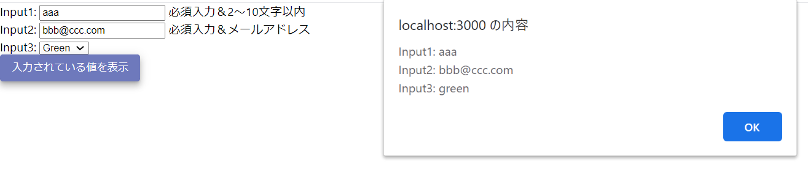

# sample-formik-01
formikのサンプル（基本）

## インストール

```
> yarn add formik
> yarn add yup
> yarn add @material-ui/core
```

## GitHub

■Formik  
https://github.com/jaredpalmer/formik

■yup（Formik公式推奨のバリデーション実装ライブラリ）  
https://github.com/jquense/yup

## WebSite

■Formik  
https://jaredpalmer.com/formik/

## 画面イメージ

  


## 備考

- Material-UIのコンポーネントで実装するには、「formik-material-ui」を利用しないといけない？（別途検証）
https://jaredpalmer.com/formik/docs/3rd-party-bindings  
https://github.com/stackworx/formik-material-ui

